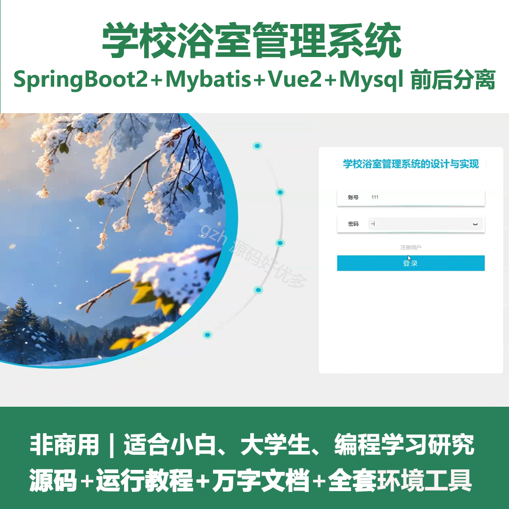
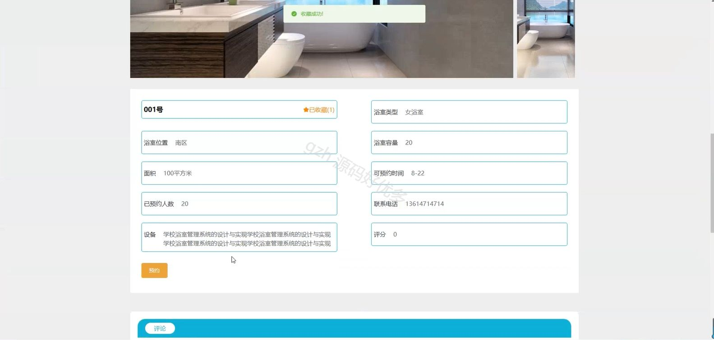
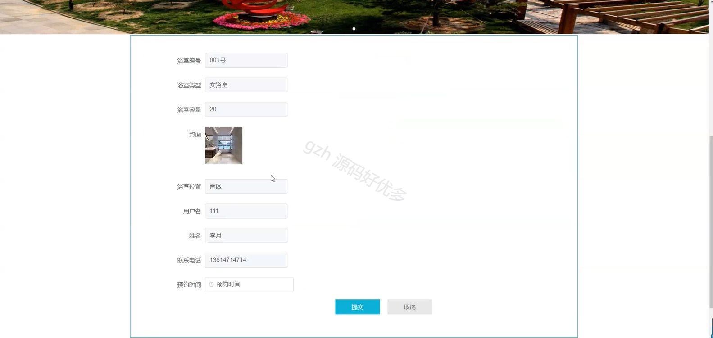
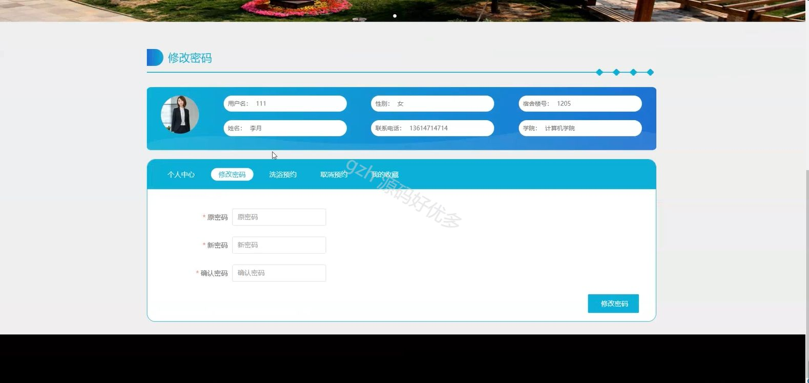
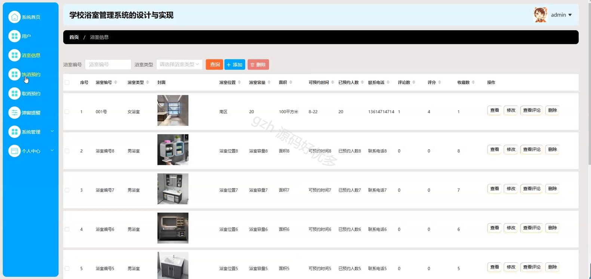
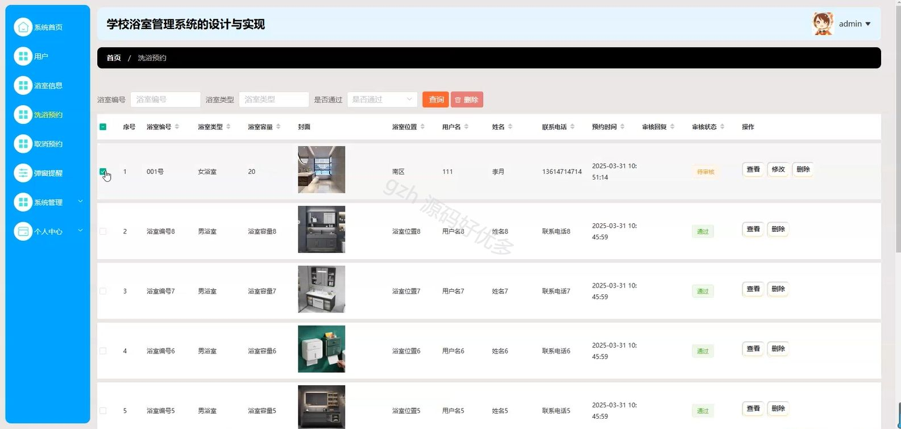
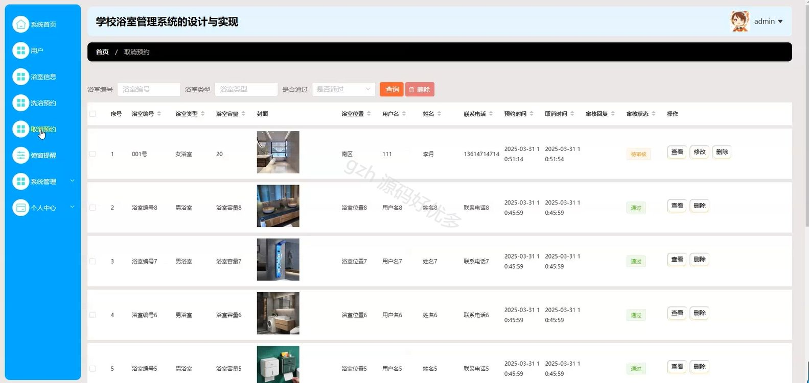
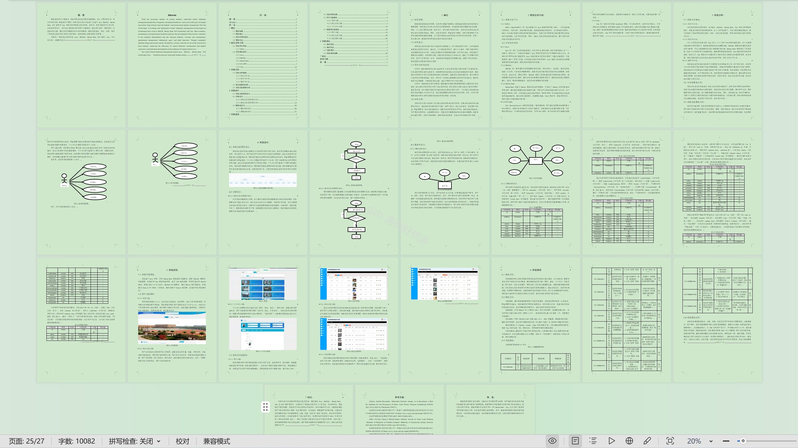

# springbootA390D
springbootA390D学校浴室管理系统
## 查看主页获取源码

### 一、关键词

浴室信息、洗浴预约、浴室管理

 

### 二、作品包含

源码+数据库+设计文档万字+全套环境和工具资源+部署教程

 

### 三、项目技术

前端技术：Html、Css、Js、Vue2.0、Element-ui 
后端技术：Java、SpringBoot2.0、MyBatis

  

 

### 四、运行环境（以下版本亲测，其他版本未知，请自测）

开发工具：IDEA/eclipse  + VSCODE

数据库：MySQL5.7（最低要5.7版本）

数据库管理工具：Navicat10以上版本

环境配置软件： JDK1.8 + Maven3.6.3

前端Nodejs：14

浏览器：谷歌浏览器

 

### 五、项目介绍

项目编号：springbootA390D

学校浴室管理系统可实现对浴室预约等的智能化管理，提升浴室使用效率与服务体验。

角色：管理员、用户

管理员功能：系统首页、用户、浴室信息、洗浴预约、取消预约、弹窗提醒、系统管理、个人中心。

用户功能：首页、浴室信息、浴室公告、个人中心、修改密码、洗浴预约、取消预约、我的收藏。

 

### 六、运行截图

